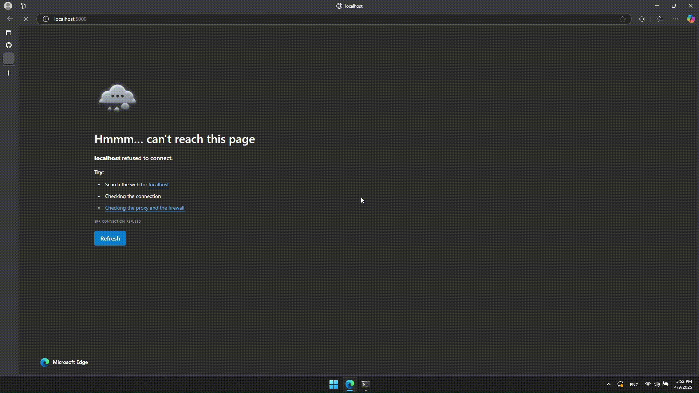

#SDG Ai Image Classification
**Ai Image Classification Project**

---
## Table of Contents
- [Showcase](#showcase)
- [Features](#features)
- [Installation](#installation)
- [DataSet Information](#dataset)
---
## Showcase

---
---
## Features
- Classifies images into **organic** or **recyclable**.
- Implements seamless for client-server disruptions.
---
## Installation
```
# Clone the repo 
git clone https://github.com/AbdullahElsheshtawy/SDG-Ai-Image-Classifcation
cd https://github.com/AbdullahElsheshtawy/SDG-Ai-Image-Classifcation

# Setup the python virtual environment
python -m venv .venv

# if on windows do this
.venv/Scripts/active
# else
.venv/bin/activate

# Install the required dependencies
pip install -r requirements.txt
```

## DataSet
Organic vs Recyclable dataset was obtained from [kaggle](https://www.kaggle.com/datasets/techsash/waste-classification-data)
